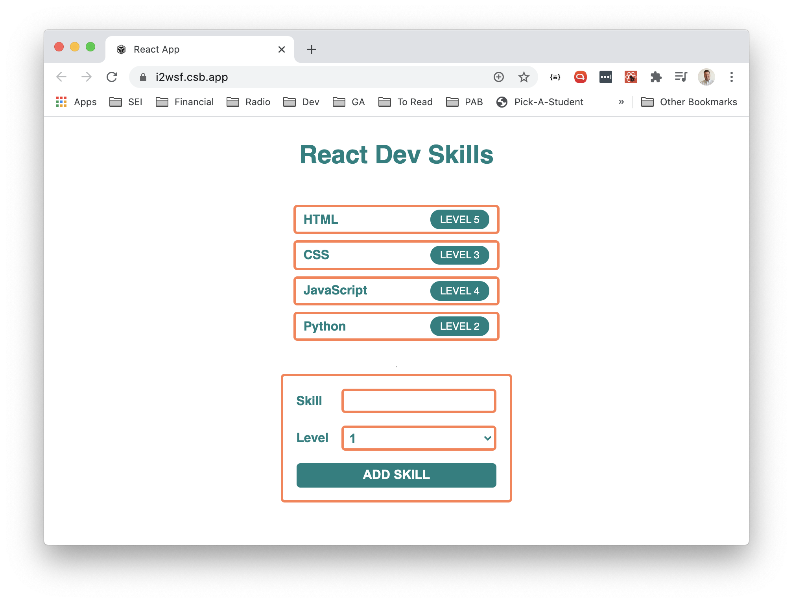

# React Dev Skills Lab

#### Intro

Now that you've learned a bit about components in React, let's practice defining and rendering a few more. This lab is a repetition exercise, meant to reinforce what you covered during the React Intro and Components lesson rather than introduce anything new.

#### Setup

Get your project scaffolded and running before you start on the exercise.

1. Clone this repo and `cd` into it.
2. Run `npm create vite@latest . -- --template react-ts` to scaffold the project into the current directory. If prompted about the directory not being empty, choose to keep your existing files.
3. Remove the cloned git history with `rm -rf .git`, then run `git init` to start a fresh repo and connect it to your own remote with `git remote add origin <your-repo-url>`.
4. Run `npm install` to install the project's dependencies. Scaffolding the project only writes the files, it doesn't download the packages those files depend on, so this step is required before anything will run.
5. Run `npm run dev` to start the dev server.

#### Exercise

The goal of this lab is to put in a rep doing everything you did during the React Intro and Components lesson. Code the app so that it renders the following UI:

The page displays a heading, a list of skill cards, and a form for adding a new skill. Each skill card shows the name of the skill alongside a pill-shaped badge with its level. The form beneath the list has fields for a skill name and a level, along with an Add Skill button.

Build this out using functional components, breaking the UI into pieces that mirror what you see on the page rather than cramming everything into a single component.